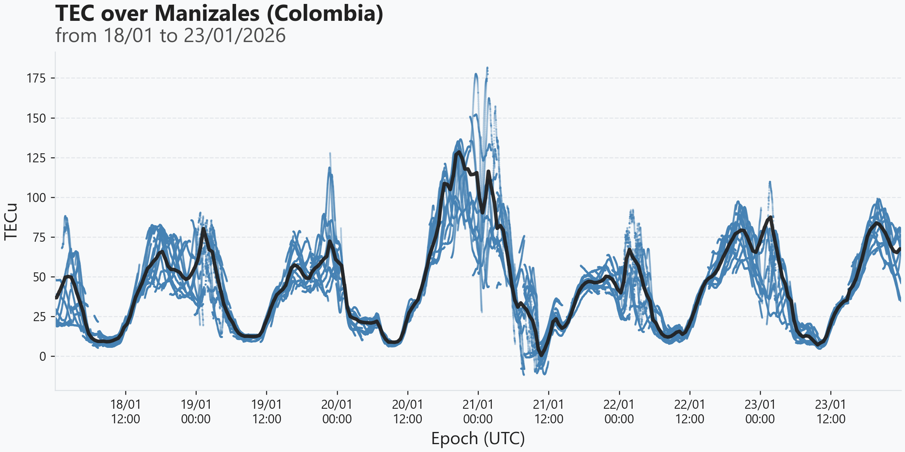

# Batch Processing 🗃️

When moving from single-file analysis to processing multi-day time series, `PyTECGg` leverages the efficiency of Polars to handle data with minimal overhead.

## Data Acquisition 📥

In a typical scenario, you might start with several observation files placed under `data/obs`. `PyTECGg` allows you to automatically fetch broadcast navigation files from global repositories.

```python
from pathlib import Path
from pytecgg.utils import download_nav_bkg

# Time window
YEAR = 2026
DOYS = list(range(55, 60))

# Define data paths
obs_path = Path("data/obs")
nav_path = Path("data/nav")

download_nav_bkg(
    year=YEAR,
    doys=DOYS,
    output_path=nav_path,
)
```

## Multi-day Analysis 🗓️

An easy way to process a long time series for a single station `STAT` is to concatenate observations before entering the calibration engine. This ensures that `extract_arcs` can track satellite arcs across day boundaries, preventing artificial bias jumps at midnight.

```python
import polars as pl
from pytecgg.parsing import read_rinex_obs, read_rinex_nav

# Collect and concatenate observations for station 'STAT'
obs_files = sorted(obs_path.glob("STAT*.rnx"))
all_obs = pl.concat([read_rinex_obs(f)[0] for f in obs_files])

# Consolidate navigation messages into a dictionary
nav_files = sorted(nav_path.glob("BRDC*.rnx.gz"))
full_nav = {}

for f_ in nav_files:
    day_nav = read_rinex_nav(f_)
    for system, df_nav in day_nav.items():
        full_nav[system] = pl.concat(
            [full_nav.get(system, pl.DataFrame()), df_nav]
        )
```

Once your data is consolidated, the workflow follows the standard pipeline but operates on the entire time series at once.

```python
from pytecgg.satellites import prepare_ephemeris, satellite_coordinates, calculate_ipp
from pytecgg.linear_combinations import calculate_linear_combinations
from pytecgg.tec_calibration import (
    extract_arcs,
    calculate_tec,
    calculate_vertical_equivalent,
)

# Enrich context and compute coordinates
ephem_dict = prepare_ephemeris(full_nav, ctx)
df_coords = satellite_coordinates(all_obs["sv"], all_obs["epoch"], ephem_dict)

# Extract arcs and compute satellites' geometry
df_lc = calculate_linear_combinations(all_obs, ctx)
df_arcs = extract_arcs(df_lc, ctx, min_arc_length=120).join(
    df_coords, on=["sv", "epoch"], how="left"
)
df_geom = calculate_ipp(df_arcs, ctx, min_elevation=20)

# Final calibrated products
df_cal = calculate_tec(df_geom, ctx=ctx)
df_veq = calculate_vertical_equivalent(df_cal, ctx=ctx)
```

## Wrapping up 🏁

As shown in the plot below, while individual satellite tracks (blue dots) reflect specific ionospheric conditions at different IPPs, the **VEq** (solid black line) provides a continuous, stable estimation of the ionospheric electron content directly above the station zenith.



Batch processing effectively smooths out individual satellite noise and spatial gradients, providing a reliable TEC estimation even across day boundaries.

--8<-- "includes/abbreviations.md"